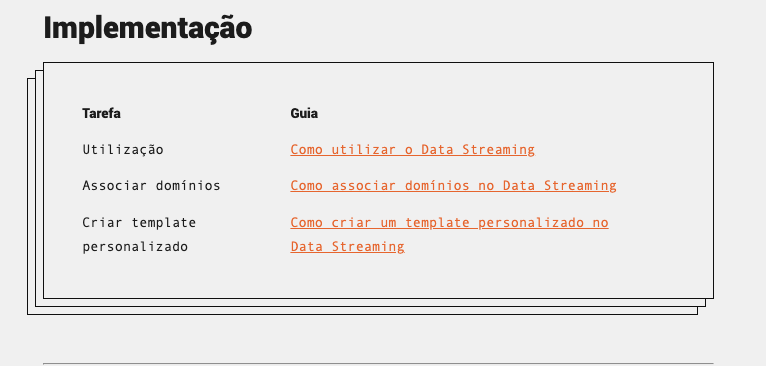

# Astro components & Azion Docs

Astro is the all-in-one web framework designed for speed. It's our currently framework when talking about Azion Docs Portal.

With the astro framework a new set of possibilities come in handy.

## .mdx files

MDX is an extension to Markdown that lets you include JSX in Markdown documents. 

We currently have a selection of components that can (and should) be used to enrich our documentation.

### Basic implementation

To use one of the listed components, we need to import it in the documentation file (.mdx file):

```js
  import Box from '~/components/tutorial/Box.astro'
```

And then call the component:

```js
  <Box icon="implementation">
  
    | Tarefa | Guia |
    | ----- | ----- |
    | Utilização | [Como utilizar o Data Streaming](https://www.azion.com/pt-br/documentacao/produtos/guias/como-usar-data-streaming/) |
    | Associar domínios | [Como associar domínios no Data Streaming](https://www.azion.com/pt-br/documentacao/produtos/guias/data-streaming-associar-dominios/) |
    | Criar template personalizado | [Como criar um template personalizado no Data Streaming](https://www.azion.com/pt-br/documentacao/produtos/guias/data-streaming-template-personalizado/) |
    
  </Box>
```

The output will be similar to:



For the complete list of available components ->>>>>> [Story Book](https://github.com/gabriel-azion/doc-studies-mocks/blob/main/astro-components/story-book.md)
