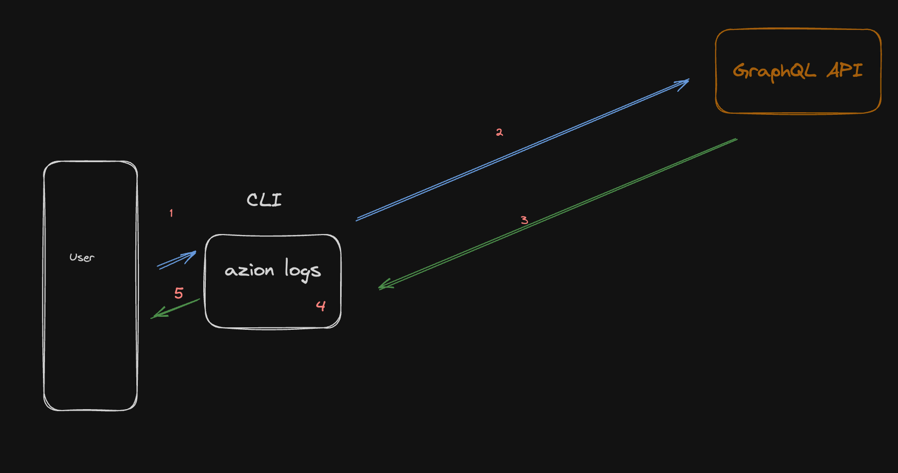
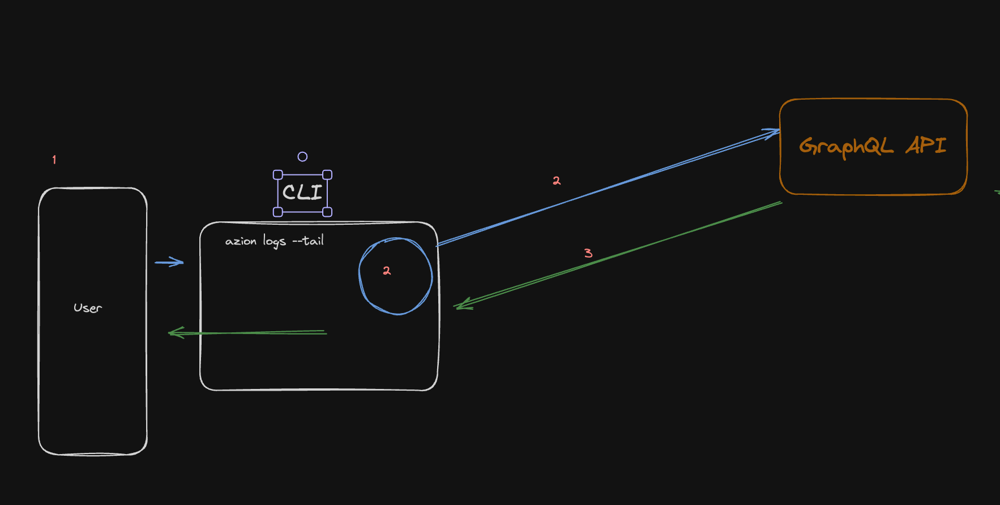

# Enhancing Edge Functions Debugging with Azion logs

Real-time logs, or live tail logs, are an invaluable resource for gaining immediate insights into your application's behavior. However, accessing these logs can often be a challenging task. 

Azion CLI simplifies this process by enabling you to monitor logs directly from your terminal. This is particularly useful for logs from your edge functions.

The `azion logs cells` command allows you to view your edge functions' `console.logs()` on your local machine, significantly enhancing the way you test and debug serverless functions. For a more continuous monitoring, the `azion logs cells --tail` command can be used to keep displaying new logs as they come in. 

While Azion CLI also supports the `azion logs http` command for accessing HTTP logs related to your edge applications, we will focus on the `azion logs cells` and `azion logs cells --tail` commands in this discussion. The `azion logs http` command will be covered in a dedicated blog post soon.

[Learn more about Edge Functions]()
[Learn more about Edge Applications]()

---

## Prerequisites for Using Azion CLI

- [Azion CLI installed](https://www.azion.com/en/documentation/products/azion-cli/overview/#installing-azion-cli).
- Node.js ≥ 18.
- Access to the command line.

---

## Behind The Scenes: How Azion CLI live tail logs Work

### Azion logs



#### Dataflow

1. The user initiates the process by executing the command `azion logs [ cells || http ]`.
2. The Azion CLI interacts with the GraphQL API.
3. The GraphQL API responds by returning logs from the last five minutes.
4. The CLI processes and interprets this data.
5. The logs are then presented to the user, with an option to display the data in a more readable, beautified format.

### Azion logs with live tail 



#### Dataflow

1. The user initiates the process by running the command `azion logs [ cells || http ] --tail`.
2. The Azion CLI then continuously calls the GraphQL API, each time starting from the timestamp of the last log that was displayed on the screen.
3. The GraphQL API responds by returning the requested data.
4. The CLI then processes and interprets this data.
5. Finally, the logs are returned to the user. The user has the option to receive this data in a more readable, beautified format.

### Responsibilities

**Azion CLI**: serves as the interface for user interaction and is responsible for formatting and returning the data to the user.

**GraphQL API**: handles the incoming requests (communicates with beholder) and retrieves the requested data.

---

## Putting It into Practice: Checking edge functions logs

### Checking logs locally

1.  Open your terminal.
2.  Run `azion init`.
3.  Choose the JavaScript template.
4.  Decide to run it locally.
5.  Install the dependencies.
6.  Edit the `main.js` file, created by the init command. Add `console.log()` statements as needed. Sample log statements to use for inspecting the request data:

```js
export default function myWorker(event) {
  // Log the event Request URL
  console.log("Request URL: ", event.request.url);
  // Log the event Request method
  console.log("Request Method: ", event.request.method);
  // Log the event Request headers
  console.log("Request Headers: ", event.request.headers);
  // If event.request.method is 'POST' or 'PUT', log the request body as well
  // Be aware: reading the body will consume it, so it will not be available for fetching anymore
  if (["POST", "PUT"].includes(event.request.method)) {
    event.request
      .clone()
      .text()
      .then((bodyText) => {
        console.log("Request Body: ", bodyText);
      });
  }
  return new Response("Hello, World");
}
```

7.  Run `azion dev`.
8.  Access the port provided at the end of the `azion dev` command's execution:
    - Run: curl http://localhost:{{port}}.
    - Visit: http://localhost:{{port}} in your browser.
9.  Check the generated logs in the terminal when the function executes.

### Deploying your application and checking live tail logs on the Azion Edge Platform

Follow these steps:

1.  Run `azion deploy` to deploy your application to the network edge.
2.  Access your application's domain, provided at the end of the deployment process.
3.  Run `azion logs cells --tail` to retrieve live tail logs of your edge functions.

> Note: the `azion logs cells` command fetches logs from the last 5 minutes. More details are available in the [command documentation](https://www.azion.com/en/documentation/products/azion-cli/overview/#using-azion-logs-cells).

---

## Harnessing Azion logs

The `azion logs cells` command provides direct access to essential debugging information. With mindfully structured logging of your serverless functions, you can gain insights into the sequence of operations, which simplifies spotting issues. Log statuses, error messages, function-specific data, inputs, outputs, and the application's state can expedite the debugging process.

## Benefits of Localized Console Logs

Localized console logs have several benefits:

- **Improved debugging**: Bringing edge-like conditions to your local setup enables efficient debugging, significantly reducing development time.
- **Better understanding of function behavior**: You can monitor the functionality and logic of your function in real time.
- **Iterative development**: Localized console logs simplify testing for iterative development cycles, ensuring each change operates as intended.
- **Decreased server costs**: Reducing server deployments for minute changes can lower server usage and expenses.

---

## Conclusion

In conclusion, [Azion CLI](https://www.azion.com/en/documentation/products/azion-cli/overview/) provides a powerful and efficient way to debug and monitor your edge functions. With the ability to watch logs in real-time through your terminal, you can gain valuable insights into your application's behavior, significantly reducing development time and server usage costs. The `azion logs cells --tail` command, in particular, offers a real-time view of your function's behavior, making it an invaluable tool for any developer working with Azion's edge functions. Whether you're testing locally or deploying your application on the Azion Edge Platform, these tools provide a streamlined and effective approach to debugging and monitoring.
