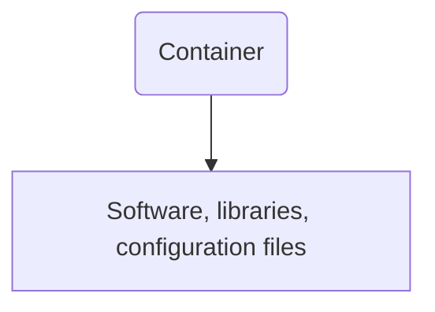
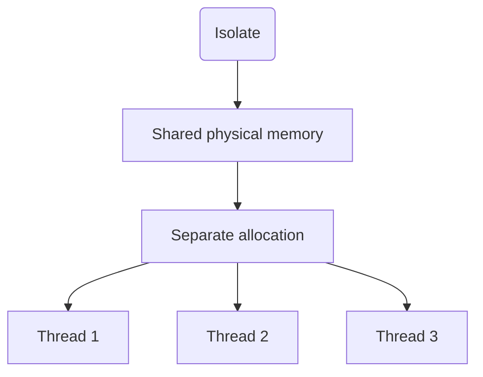

# Containers vs Isolates in Serverless Functions

When developing serverless functions, it's extremely crucial to choose the appropriate execution environment. Two distinct possibilities that developers often encounter are **Containers** and **Isolates**. While containers have been used traditionally, isolates are gradually gaining attention, especially with their suitability for edge computing.

Before we delve into details, let's understand what these two options are.

## Containers

A container is a standard unit of software that packages up code with all the dependencies, making the application run quickly and reliably from one computing environment to another. They are isolated from each other and bundle their own software, libraries and configuration files. Docker and Kubernetes are examples of containerized technologies.

## Isolates

On the other hand, an isolate is a lightweight context that shares physical memory with other isolates but keeps a separate allocation. A single isolate can have multiple threads, but they need to share the isolate's main heap. A thread within an isolate can produce new isolates.

Now, let's delve into the crucial differences between containers and isolates.

## Application Start-Up Time

* **Containers:** The start-up time of a function in a containerized environment might take a few seconds to several minutes, depending on the hardware, bandwidth and the size of container image.
* **Isolates:** Isolates take significantly less time to start, usually in the milliseconds range.

## Resource Usage

* **Containers:** Containers encapsulate the entire runtime environment and require a comparatively larger amount of resources.
* **Isolates:** Isolates are more efficient and lightweight. They can share resources like memory and CPU across multiple instances.

## Scalability

* **Containers:** Scaling is possible with containers, but it can be slower due to the larger boot-up times and resource requirements.
* **Isolates:** Isolates, due to their lightweight nature and fast-start capabilities, can be scaled instantly to handle incoming demand.

