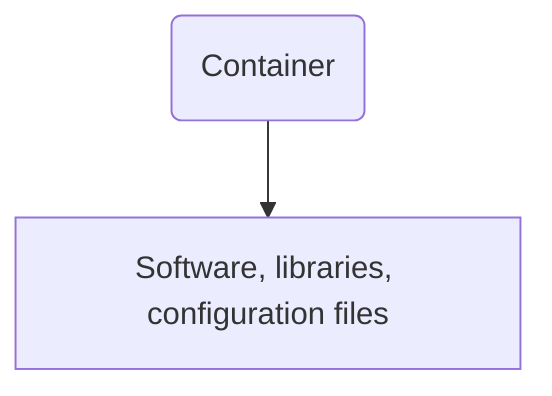
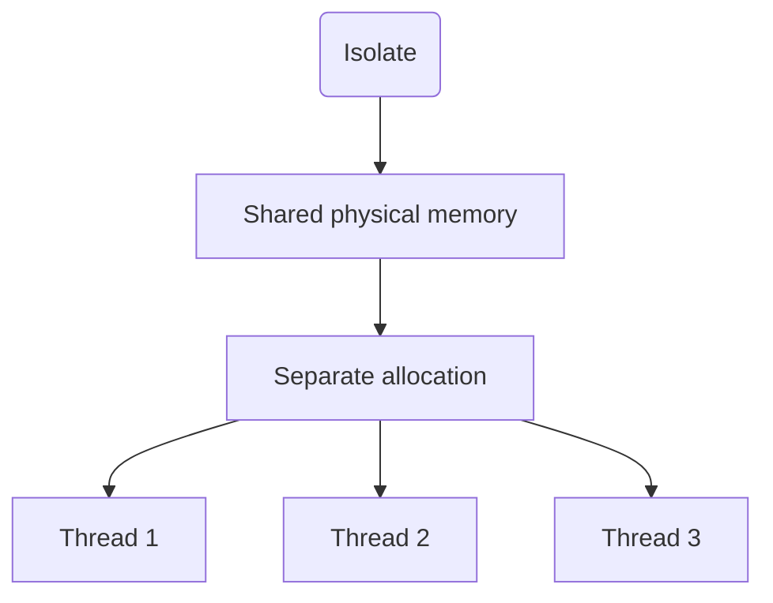

# Containers vs Isolates in Serverless Functions

When developing serverless functions, it's extremely crucial to choose the appropriate execution environment. Two distinct possibilities that developers often encounter are **Containers** and **Isolates**. While containers have been used traditionally, isolates are gradually gaining attention, especially with their suitability for edge computing.

Before we delve into details, let's understand what these two options are.

---

## Containers

A container is a standard unit of software that packages up code with all the dependencies, making the application run quickly and reliably from one computing environment to another. They are isolated from each other and bundle their own software, libraries and configuration files. Docker and Kubernetes are examples of containerized technologies.

---

## Isolates

On the other hand, an isolate is a lightweight context that shares physical memory with other isolates but keeps a separate allocation. A single isolate can have multiple threads, but they need to share the isolate's main heap. A thread within an isolate can produce new isolates.

Now, let's delve into the crucial differences between containers and isolates.

---

## Application Start-Up Time

* **Containers:** The start-up time of a function in a containerized environment might take a few seconds to several minutes, depending on the hardware, bandwidth and the size of container image.
* **Isolates:** Isolates take significantly less time to start, usually in the milliseconds range.

---

## Resource Usage

* **Containers:** Containers encapsulate the entire runtime environment and require a comparatively larger amount of resources.
* **Isolates:** Isolates are more efficient and lightweight. They can share resources like memory and CPU across multiple instances.

---

## Scalability

* **Containers:** Scaling is possible with containers, but it can be slower due to the larger boot-up times and resource requirements.
* **Isolates:** Isolates, due to their lightweight nature and fast-start capabilities, can be scaled instantly to handle incoming demand.

---

## Conclusion 

In conclusion, the use of V8 Isolates instead of traditional containers in serverless functions at the Edge presents several significant advantages:

**Efficiency**: Isolates are highly lightweight, allowing a single process to run thousands of individual code instances seamlessly. This efficiency allows for substantial cost savings, since the overhead of traditional virtual machine or container-based environments is entirely circumvented.

**Performance**: Since Isolates don't require launching a new process for execution, they can start almost instantaneously, thereby eliminating the "cold start" problem commonly associated with traditional serverless platforms.

**Scalability**: The light weight of Isolates facilitates their rapid deployment and scaling and enables execution in an unprecedented number of locations (in reference to the case presented, 155 data centers). 

**Security**: The use of V8, a well-secured open-source JavaScript engine, is a significant plus. Speed doesn't come at the expense of security since V8 Isolates are designed to prevent access to the memory of other Isolates, ensuring the integrity of each piece of code.

**Billing**: Further sweetening the Isolate's appeal is an advantageous billing system, where users pay only for execution time, not idle time. The considerably smaller memory footprint of Isolates makes this IT cost management feasible.

**Simplified Management**: Isolates discard the need for heavyweight orchestration systems like Kubernetes, simplifying systems management.

The demonstrated benefits have the potential to drive a significant shift in serverless computing, moving away from traditional container-based approaches in favor of Isolate-based computing strategies. 

