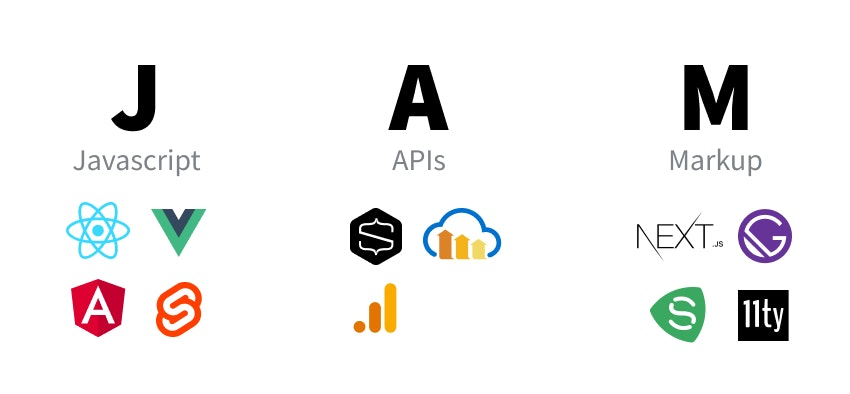

# Running Jamstack Applications on the Edge

## Introduction

In the ever-accelerating, hyper-connected digital landscape, where speed, accessibility, and user experience reign supreme, a powerful synergy is emerging at the forefront of web development. Imagine a scenario where the seamless dynamism of Jamstack meets the capabilities of edge computing, a fusion that is redefining how we deliver web applications to a global audience.

In this exploration, we embark on a journey to uncover the profound impacts on the web development landscape. Jamstack, renowned for its simplicity, scalability, and security, joins forces with edge computing, a distributed computing paradigm that pushes computation closer to the user.

As we delve deeper into this synergy, we'll discover how it is poised to enhance not only the performance and reliability of web applications but also the overall user experience. From reducing latency to mitigating downtime, the possibilities are boundless.

## Web Development Before the Jamstack Revolution

.

Before the advent of Jamstack architecture, web development was characterized by a different set of paradigms and practices. In this retrospective glimpse, we explore the landscape of web development that preceded the Jamstack revolution.

**Server-Side Rendering (SSR)**

Traditional web development relies heavily on server-side rendering. When a user requests a web page, the server processes and generates the complete HTML for that page before sending it to the user's browser. This server-centric approach handled everything from rendering content to managing data.

**Monolithic Architectures**

Websites and web applications were often built as monolithic entities, where all the components, including the front-end presentation, back-end logic, and database, were tightly integrated. This tightly coupled architecture made it challenging to scale and maintain applications, especially as they grew in complexity.

**Full-Stack Development**

Developers were often required to be proficient in both front-end (HTML, CSS, JavaScript) and back-end (server-side scripting, database management) technologies. This full-stack approach demanded a broad skill set and a deep understanding of multiple technologies.

**Traditional Databases**

Relational databases, like MySQL and PostgreSQL, were commonly used to store and manage data. These databases provided structured data storage, which was well-suited for the server-side processing common in traditional web development.

**Complex Hosting and Scaling**

Hosting and scaling web applications required intricate server configurations, load-balancing setups, and server maintenance. These complexities often introduced challenges in terms of cost, performance, and reliability.

**Security Concerns**

Security was a significant concern in traditional web development, with various attack vectors targeting vulnerabilities in server-side code and databases. Developers had to implement robust security measures to protect against threats like SQL injection and cross-site scripting (XSS) attacks.

Pre-Jamstack web development was characterized by a server-centric model, where servers were pivotal for content rendering and data management. While this approach worked for numerous applications, it introduced inherent intricacies such as scalability issues, the necessity for developers to possess diverse skill sets, and raised security vulnerabilities. The advent of Jamstack architecture represented a substantial transition towards a more modular, streamlined, and security-conscious methodology for constructing web applications.

## Jamstack, Edge Computing, and Content Delivery

### A Symbiotic Relationship

In the realm of modern web development, where speed and accessibility are paramount, the marriage of Jamstack architecture with edge computing represents a pivotal leap forward. This union not only enhances the performance of web applications but also revolutionizes the way content is delivered to end-users.

**Reducing Latency and Accelerating Load Times**

At the heart of this synergy lies the concept of edge computing. Instead of relying on a centralized server, edge computing distributes processing and data storage closer to the user, often leveraging a network of edge servers strategically positioned around the globe. This proximity significantly reduces latency—the delay in data transfer between the client's device and the server.

In the context of Jamstack applications, this means that when a user requests a web page or interacts with an application, the content can be delivered from the nearest edge server, dramatically reducing the time it takes to load. This snappy responsiveness enhances the overall user experience, ensuring that your audience stays engaged and satisfied.

**Enhancing Scalability and Reliability**

Edge computing also plays a pivotal role in scaling Jamstack applications. Traditional server-based architectures face challenges when sudden surges in traffic occur, often leading to slowdowns or outages. With edge computing, the burden of handling traffic spikes is distributed across multiple edge servers, ensuring that your application remains responsive and available, even during high-demand periods.

Moreover, edge servers are engineered for high availability, with redundancy and failover mechanisms in place. This means that your Jamstack application can enjoy a level of reliability that was previously challenging to achieve in a centralized server setup.

**Global Content Delivery**

Content delivery becomes a breeze with this fusion. Jamstack applications often serve static assets—HTML, CSS, JavaScript, and media files. These assets can be cached and distributed across edge servers worldwide. When a user requests content, it's delivered from the edge server closest to their geographical location, reducing the distance data needs to travel and, in turn, speeding up the content retrieval process.

This global content distribution network not only accelerates load times but also enhances content availability, irrespective of a user's location. It's as if your Jamstack application is always just around the corner, regardless of where your users are situated.

**A Seamless User Experience**

In summary, the synergy of Jamstack architecture with edge computing creates a harmonious environment where web applications are not only faster and more reliable but also more accessible to a global audience. This partnership redefines how we think about content delivery, as it optimizes every aspect of the user experience, from load times to responsiveness.

As we continue to explore the intricacies of running Jamstack applications on the edge, we'll uncover how this symbiotic relationship is reshaping the digital landscape, ensuring that web applications aren't just functional but delightful to use, no matter where you are in the world.

## Deploying Jamstack applications on the Edge of the network

The developer experience stands as a critical cornerstone. It's the juncture where innovation takes shape, where challenges turn into opportunities, and where lines of code transform into remarkable solutions. Platforms like Azion focus on the developer experience as a way to implement ground-breaking solutions and offer journeys that aim to reduce the friction between developing and deploying applications.

Azion offers a journey through their CLI, which installing methods can be found on their [official documentation](https://www.azion.com/en/documentation/products/azion-cli/overview/).

### Practical example

With the Azion CLI installed properly in your machine, run:

```
azion
```

> The `azion` command is an alias to the `init` command. It starts the processing by initializing and gives you the option to run the application locally or deploy it to the edge.

Accept the suggested name, or choose a new one:

```
(Hit enter to accept the suggested name in parentheses) Your application's name:  (serene_strength) 

```

Choose a template:

```
Choose a template for your project: (Use arrow keys)
❯ Angular 
  Astro 
  Hexo 
  Next 
  React 
  Vue 
  Vite 
```

In this example, I won't run it locally:

```
? Do you want to start a local development server? (y/N) n
```

We're going to deploy the application

```
? Do you want to deploy your project? (y/N) y
```

Install the dependencies:

```
? Do you want to install project dependencies? This may be required to deploy your project (y/N) y
```

Now, the application undergoes a build and it's deployed to the Edge. The build process is taken over by a tool called Vulcan, which adapts the frameworks to run right from the edge.

When the deployment is complete, a domain is provided. Wait a few minutes so the propagation takes place, and then access your application using the provided domain, which should be similar to `https://xxxxxxx.map.azionedge.net`.

## Conclusion

In conclusion, the fusion of Jamstack architecture with edge computing represents a significant shift in the web development landscape. It marks a departure from the complexities of server-centric, monolithic approaches towards a future prioritizing speed, accessibility, and user experience. This synergy reduces latency, improves scalability, and ensures global content delivery, resulting in faster, more reliable web applications accessible to a global audience. Companies like Azion and tools like the Azion CLI simplify deployment, empowering developers to create innovative solutions effortlessly. As we navigate this transformative journey, we look forward to a future where user experience reigns supreme, offering boundless possibilities.

Welcome to the future of web development!